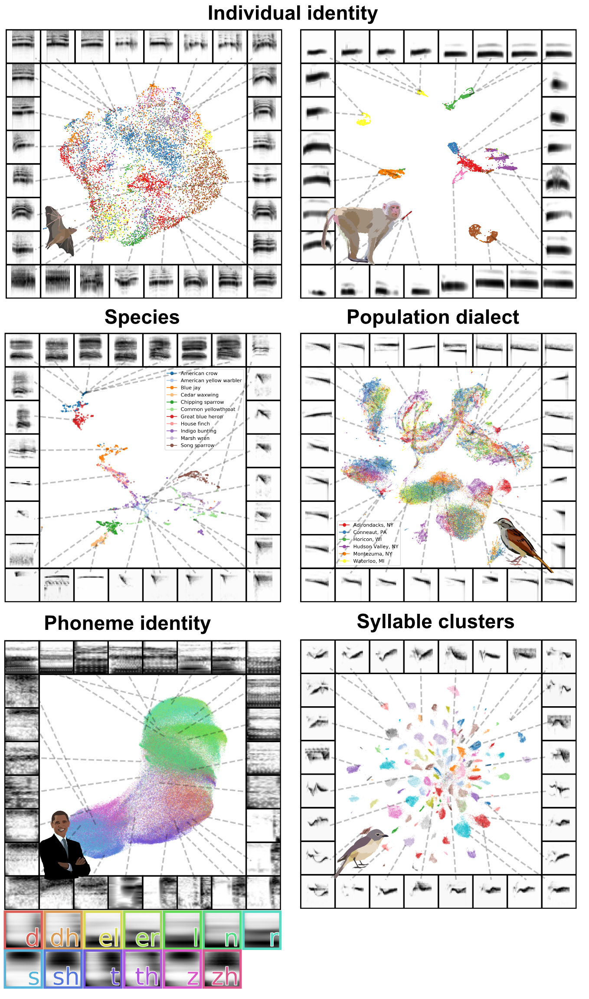
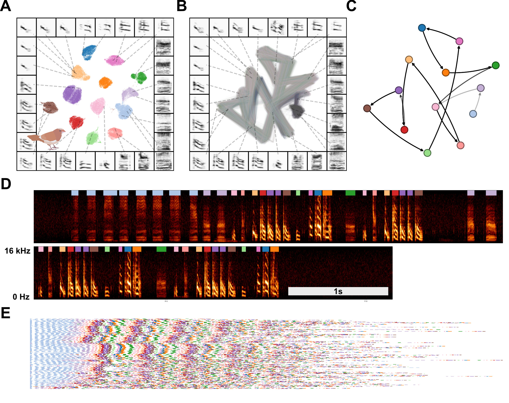
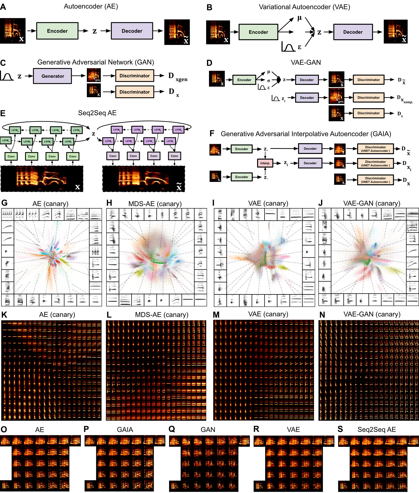

Animal Vocalization Generative Network (AVGN)
==============================

This paper reproduces all of the figures in the [Sainburg et al., (2020)](https://doi.org/10.1371/journal.pcbi.1008228): 

```
@article{sainburg2020finding,
  title={Finding, visualizing, and quantifying latent structure across diverse animal vocal repertoires},
  author={Sainburg, Tim and Thielk, Marvin and Gentner, Timothy Q},
  journal={PLoS computational biology},
  volume={16},
  number={10},
  pages={e1008228},
  year={2020},
  publisher={Public Library of Science}
}
```

Animal Vocalization Generative Network (AVGN) is a repository of python tools centered around latent models used to generate, visualize, and characterize animal vocalizations. The code for this repository supports the paper Tim Sainburg et al., (reference below). 

Currently, there are three seperate repositories for AVGN: The first at [github.com/timsainb/avgn](github.com/timsainb/avgn) that hosts an earlier and less feature rich, the second [this repository's older version](github.com/timsainb/avgn_paper) and this one [this repository](github.com/colquittlab/avgn). There are more species and examples in the last two repos, but they are not as clean and might be a bit harder to figure out. This repo is a hosting of a previously produced repo and utilizes variational autoencoders to analyize birdsong. 

## Discrete latent projections of vocalizations
Unsupervised latent projections reveal structure in vocal repertoires between and across individuals, populations, and species. 



## Abstracting sequential organization
The sequential organization of birdsong can be abstracted into symbolic sequences in a fully unsupervised manner. 


## Latent trajectories of vocalizations
Vocalizations from diverse species can be treated as latent trajectories revealing short and long timescale dynamics without abstrating vocal sequences to discrete elements or categories.  


## Generating new vocalizations from latent space
Latent spaces can be sampled from to generate new vocal elements in a systematic manner. These sampled elements can be used for behavioral and physiological experiments. 



<hr \>
<hr \>

# I want to use these tools on my own dataset. 
Great! The purpose of this repository is for you to be able to apply these tools to your own dataset. To use these tools, you are going to need to be somewhat proficient in python and jupyter notebooks. If you haven't used python or jupyter before, these notebooks can be an opportunity to learn! But first take some time to learn the basics. 


## Getting started
You have a dataset of animal vocalizations and you want to use AVGN to analyse them. Currently, your data is in some format that *probably* isn't the exact same as the one used in AVGN. This is a very breif guide to how to use this repository, so feel free to send me an email if you're running into trouble. The broad steps are: 


1. Clone and install AVGN
2. Convert your data into the correct format. 
3. Run analyses on your correctly formatted data


### UPDATE: We added a tutorial walking you through AVGN on a Bengalese finch dataset
See the tutorials folder. This tutorial should make applying AVGN to your own data more clear.

### 0. Preparing Environment for Jupyter Lab
0. Establishing secure shell connection to Lark using command prompt - Enter CruzID then enter password when requested
    >shh <CruzID>@lark.ucsc.edu
    >password 

1. Install Micromamba in Lark secure shell command line using:  
    >"${SHELL}" <(curl -L micro.mamba.pm/install.sh)

2. Activate base environment & install jupyter
	>micromamba activate  # this activates the base environment
    >micromamba install python jupyter -c conda-forge

3. Create environment to run kernel 
    >micromamba create -n SongAnalysis python=3.10
    >micromamba activate SongAnalysis
    >micromamba install ipykernel ……
    >python -m ipykernel install --user --name=SongAnalysis
    >micromamba deactivate

4. Set Up Proper JupyterLab config in home directory
    >cd
    >micromamba activate 
    >jupyter lab --generate-config

5. Edit config file to run on Lark
    >cd .jupyter/
    >nano jupyter_lab_config.py 
    Ctr + w 
    >.ip
    Replace "c.ServerApp.ip = ‘localhost/127.0.0.1’" with "c.ServerApp.ip = ‘*’"
    Ctr + x 

6. Running Jupyter Lab using screen
    >screen 
    >micromamba activate # this activates the base environment 
    >jupyter lab
    Copy token provided into web browser to enter Jupyter lab 
    >Ctr + A , Ctr + D # this exits the screen and returns to main


### 1. Clone and install AVGN

1. Navigate to the foler in your local environment where you want to install the repository. 
    >cd 
    >cd micromamba/envs/SongAnalysis

    Then type:
    >micromamba activate SongAnalysis
    >git clone https://github.com/colquittlab/avgn.git (now uses pyproject.toml)

2. Install the package by typing: 
    >pip install -e .

### 2. Getting your data into the right format
In building AVGN, we found datasets prepared in several different formats. To use AVGN, you'll need to translate your dataset from whatever format you currently have it in, to our format. Luckily (1) you have [several different examples]() to work off of, in trying to figure out how to translate your dataset into our format, and (2) the format we use is pretty universal and pretty easy. 

There are three files you want to generate for your dataset: 
1. `.WAV` files of each of your vocalization files 
2. `.JSON` files with WAV general information, as well as unit information

An example JSON file with metadata:

```
{
    "length_s": 15,
    "latitude": "32.83",
    "longitude": "-117.27",
    "samplerate_hz": 48000,
    "wav_location": "/location/of/my/dataset/myfile.wav",
    "noise_file": "/location/of/my/dataset/myfile.wav",
    "weight": 30,
    "indvs": {
        "B1534": {
            "species": "European starling",
            "group": "group1",
            "partner": "B1534",
            "age": "15 days",
            "units": {
                "syllables": {
                    "start_times": [1.5, 2.5, 6],
                    "end_times": [2.3, 4.5, 8],
                    "labels": ["a", "b", "c"],
                    "Hz_min": [600, 100, 200],
                    "Hz_max": [5000, 4000, 6000],
                    "contexts": ["singing", "fighting", "fleeing"],
                },
                "notes": {
                    "start_times": [1, 1.5, 6.4],
                    "end_times": [21.1, 1.8, 7.0],
                    "labels": ["1", "4", "2"],
                },
            },
        }
    },
}
```

If the data is not segmented, or does not have much metadata, you'll just want to fill in the information you have. E.g.:

```
{
    "length_s": 15,
    "samplerate_hz": 48000,
    "wav_location": "/location/of/my/dataset/myfile.wav",
    "indvs": {
        "B1534": {
            "species": "European starling",
        }
    },
}
```

To get data into this format, you're generally going to have two write a custom parser to convert your data from your format into AVGN format. There are numberous examples in `avgn/custom_parsing/`. 

### 3. Running analyses on your correctly formatted data
Now that your data is in the right format, this shouldn't be too difficult. Just look at the other notebooks and apply those methods to your dataset!

<hr \>


Project Organization
------------

This is a rough outline of the organization of this repository:

    ├── LICENSE
    ├── README.md                              <- The top-level README for developers using this project.
    ├── data                                   <- Vocalization data should be stored here 
    ├── docs                                   <- General documentation on AVGN
    ├── lab_based_notebooks                    <- Jupyter notebooks relevant to birdsong analysis. 
    ├── notebooks                              <- Jupyter notebooks. 
    │   ├── 00.0-download-datasets             <- Downloads some of the datasets used in the paper
    │   ├── 00.1-data-exploration              <- Loose scratchpads to explore some datasets.
    │   ├── 01.0-custom-parsing                <- Parse datasets from original format into AVGN jsons
    │   ├── 01.1-syllabic-segmentation         <- Segment unsegmented datasets using dynamic thresholding
    │   ├── 01.1-visualize-dataset-elements    <- In a few datasets this is used to visualize at syllables
    │   ├── 02.0-make-syllable_df              <- Get dataset of syllable spectrograms from WAVs
    │   ├── 02.1-project-UMAP                  <- Project syllable spectrograms into umap (discrete)
    │   ├── 02.5-make-projection-dfs           <- Make dataset of umap projections of discrete syllables
    │   ├── 03.0-compare-clusters-vs-labels    <- Compare clusters vs labels in bengalese finch
    │   ├── 04.0-clusters-vs-labels-metrics    <- Compare clusters vs labels with metrics (finch + cassins)
    │   ├── 05.0-viz-transitions-continuous    <- continuous latent trajectories
    │   ├── 05.1-viz-transitions-discrete      <- discrete latent projections + clustering + markov modelling
    │   ├── 06.0-neural-networks               <- starling and canary projections + sampling
    │   ├── 07.0-segmentation-examples         <- Examples of dynamic thresholding segmentation
    │   ├── 08.0-human-phones-analyses         <- Discrete projections of phones
    │   ├── 09.0-clusterability                <- Clusterability measures
    │   ├── 10.0-dataset-statistics            <- General statistics of the datasets I used in the paper
    │   └── 11.0-umap-projection-fig           <- Fig 1 in the paper. 
    │
    ├── pyproject.toml                         <- For reproducing the analysis environment.
    │
    ├── setup.py                               <- makes project pip installable 
    ├── avgn                                   <- Source code for use in this project.
    │   ├── clusterability                     <- X
    │   ├── custom_parsing                     <- custom parsing for each dataset.
    |   |                                         could as easily be done in a notebook
    │   ├── downloading                        <- functions to download datasets 
    │   ├── signalprocessing                   <- various signal processing functions
    │   ├── song_segmentation                  <- segment bouts from wavs
    │   ├── tensorflow                         <- neural network models
    │   ├── utils                              <- general functions
    │   ├── VAE_analysis                       <- functions to analyze latent space 
    │   ├── dataset.py                         <- python dataset object for handing json data
    │   └── visualization                      <- various types of visualizations
                                                  


## Notes
- There are only notebooks to download datasets for a subset of the datasets that are freely available online. This is because I didn't think to write these as notebooks until later in the analysis pipeline. If you want to write a notebook to download any other datasets, I would be glad to pull it in. 
- Many of the datasets I took a look at didn't make it into the final analysis. For most of these datasets, the reason was that it was too time-consuming to clean up the data before it could be used for my purposes (e.g. segmenting vocalizations out from long noisy recordings). I left most of the exploration notebooks in this repository so that you could take a look at them yourself. 
- I didn't add spectrogram inversion to these notebooks yet. In the past, I've just used griffin and lim inversion. I have an [implementation of griffin + lim in the other avgn repository](https://github.com/timsainb/avgn). [I also have a notebook version in another repository with a google colab example](https://github.com/timsainb/tensorflow2-generative-models). It should be pretty straightforward to get working, but if you're having trouble just ask. It might also be worth looking into [other spectrogram inversions techniques](https://anclab.org/software/phaserecon/). If you have a good example inversion notebook you would like to pull into this repo, please do so!
- For neural networks you need to install Tensorflow >=2.0. Ideally, install the GPU version on a decent computer to run networks at a reasonable speed. I didn't add tensorflow to the requirements because I don't want to mess with your current installations. 
--------

## Citation

If you use this repository in your research, please cite our paper:

Sainburg T, Thielk M, Gentner TQ (2020) Finding, visualizing, and quantifying latent structure across diverse animal vocal repertoires. PLoS Comput Biol 16(10): e1008228. https://doi.org/10.1371/journal.pcbi.1008228

--------

<i> <small>Project based on the <a target="_blank" href="https://drivendata.github.io/cookiecutter-data-science/">cookiecutter data science project template</a>. #cookiecutterdatascience</small></i>
